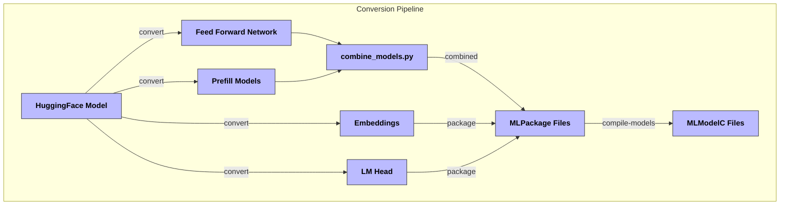

# ANEMLL Flow Documentation

## Architecture Overview

## Component Descriptions

### Conversion Pipeline

The conversion process consists of several stages:

1. **Model Splitting**
   - Embeddings Layer
   - Feed Forward Network (FFN)
   - Language Model Head (LM Head)
   - Prefill Models for KV cache

2. **Packaging**
   - Creates MLPackage files for each component
   - Handles quantization and optimization
   - Manages file size constraints (1GB iOS limit)

3. **Compilation**
   - Converts MLPackage files to MLModelC format
   - Optimizes for on-device inference

### Utility Components

1. **combine_models.py**
   - Merges FFN and prefill chunks
   - Reduces weight size by 50%
   - Creates Multi-Function Chunks

2. **compile_models.py**
   - Handles final compilation step
   - Produces device-ready MLModelC files

3. **convert_model.sh**
   - Orchestrates entire conversion process
   - Manages intermediate steps
   - Handles error recovery

## File Size Considerations

- iOS models limited to 1GB
- macOS supports ~2GB
- Models split during conversion to meet size limits
- FFN split into multiple chunks for large models

## Performance Optimizations

1. **KV Cache**
   - Prefill models optimize KV cache operations
   - Uses Stateful API for ANE (iOS 18 / macOS 15)

2. **Weight Sharing**
   - FFN and Prefill chunks share weights
   - Reduces total model size by 50%

3. **Quantization**
   - Supports LUT quantization
   - Configurable bits per weight
   - Balance between size and accuracy

## Usage Flow

1. Download model from HuggingFace
2. Run conversion pipeline
3. Compile for target device
4. Deploy using chat interfaces

## Implementation Notes

- Requires Python 3.9+
- Uses CoreML Tools for ANE conversion
- Supports LLaMA and DeepSeek models
- Extensible for other model architectures

For detailed implementation instructions, see the [Model Conversion Guide](./docs/convert.md). 